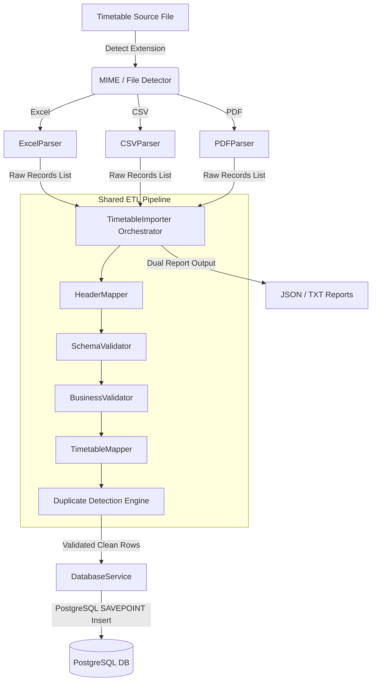

# CampusFlow AI - Parser Module Design Document

This document outlines the architecture, pipeline, data flows, and design decisions of the **CampusFlow AI Parser Module**, designed for importing university timetables into PostgreSQL.

---

## 1. Complete Parser Architecture

The parser uses a pipeline architecture separating raw extraction, mapping, validation, cleaning, and loading:



This design adheres to **SOLID** principles:
* **Single Responsibility (SRP):** Each parser class *only* reads bytes and outputs raw lists of dicts. Processing is handled by common services.
* **Open-Closed (OCP):** New file formats can be added by implementing `BaseParser` without modifying the core pipeline code.

---

## 2. File Responsibilities

* **`main.py`:** CLI entrypoint for running ingestion commands.
* **`config.py`:** Standardizes environment variables and directories.
* **`parsers/base_parser.py`:** Abstract base class defining the `parse` interface.
* **`parsers/excel_parser.py`:** Extracts rows from sheets using `pandas` and detects header rows.
* **`parsers/csv_parser.py`:** Extracts rows from CSV files.
* **`parsers/pdf_parser.py`:** Uses `pdfplumber` to extract tables and interpolate merged cells.
* **`validators/schema_validator.py`:** Verifies layout shapes and data types using `pydantic`.
* **`validators/business_validator.py`:** Enforces referential integrity checks and tracks duplicate slots.
* **`mappers/header_mapper.py`:** Fuzzy maps raw headers to database schema keys.
* **`mappers/timetable_mapper.py`:** Resolves string codes to database primary key IDs.
* **`services/importer.py`:** Manages pipeline coordination and compiles summary reports.
* **`services/database_service.py`:** Manages DB pooling and caches references.
* **`utils/logger.py`:** Configures console and file loggers.
* **`utils/constants.py`:** Stores day/semester enums and header synonyms.
* **`utils/helpers.py`:** Text cleanup, lowercase trimming, and date format sanitization.

---

## 3. Parsing Mechanisms

### Excel Parsing
Uses `pandas.read_excel`. To bypass headers and empty lines, it scans the first 10 rows and counts matches against synonym lists. The row with the most matches is selected as the header row, and subsequent data is loaded from that index.

### CSV Parsing
Uses `pandas.read_csv` and the same header detection logic as Excel, providing a unified approach to tabular files.

### PDF Parsing
Uses `pdfplumber` to extract tabular data grids.
1. **Dynamic Header Scan:** Scans the first 5 rows to locate headers using synonym keywords.
2. **Merged Cell Interpolation:** Timetables often merge rows for fields like `Day` or `Section`. The parser detects empty fields in merged columns and copies down the value from the previous row.

---

## 4. Header Mapping & Validation Flow

### Header Mapping
`HeaderMapper` maps arbitrary header names to standardized keys using synonyms defined in `constants.py`:
* *Example:* `['faculty_name', 'faculty name', 'teacher name', 'instructor', 'professor']` are all mapped to `faculty_name`.

### Validation Flow
1. **Schema Check:** Pydantic (`NormalizedTimetableRow`) validates presence and data types (e.g. `academic_year` between 2000-2100).
2. **Referential Integrity:** Checks if codes exist in the cached lookup tables (e.g. `faculty_code` exists in the system).
3. **Within-file Duplication:** Keeps a set of seen keys during ingestion to catch double-bookings in the same file.

---

## 5. Database Mapping & Duplicate Detection

### Database ID Resolution
The `TimetableMapper` converts names or codes into database foreign keys:
* maps `department_code` $\rightarrow$ `department_id`
* maps `(department_id, section_name, year, semester)` $\rightarrow$ `section_id`

### Duplicate Detection
To prevent double bookings, the system queries existing database records at the start of the session and caches them. Before inserting a record, the engine checks:
1. **Exact Duplicate:** Does this exact slot combination exist in the database?
2. **Double Booking:** Is the faculty, classroom, or section already scheduled for this slot?
If a duplicate is detected, the row is skipped and logged.

---

## 6. Import Pipeline & Error Handling

```text
Upload File 
  → Detect File Type 
  → Extract Data 
  → Header Mapping 
  → Schema Validation 
  → Business Validation 
  → Data Cleaning 
  → Data Normalization 
  → Database ID Resolution 
  → Duplicate Detection 
  → PostgreSQL Insertion 
  → Import Summary Report
```

### Error Handling
The pipeline skips invalid rows and continues processing the remaining ones. It handles errors at multiple stages:
* **Missing columns / Schema mismatch:** Logged as validation errors.
* **Lookup failure:** Logged as unknown entities.
* **Duplicate entry:** Logged as duplicates.
* **Database errors:** Isolated using savepoints (`SAVEPOINT row_insert_sp`). Failed rows are rolled back to the savepoint, and successful rows are committed at the end.

---

## 7. Import Report Generation

Two reports are generated:
1. **`import_report_<file>_<ts>.json`:** For backend integration.
2. **`import_report_<file>_<ts>.txt`:** A formatted report for administrators.

Reports track total records, successful inserts, skipped rows, validation errors, and unknown entity counts.

---

## 8. Future Extensibility

To add support for a new file format (e.g. XML):
1. Create `XMLParser` inheriting from `BaseParser`.
2. Implement the `parse` method.
3. Register the format in `TimetableImporter`'s `parser_map` in `importer.py`.
The rest of the pipeline handles mapping and validation automatically.
